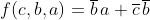
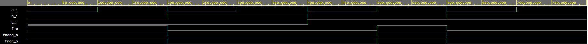
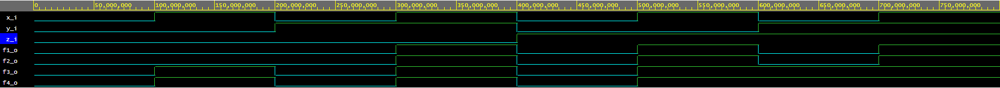

# *Lab 1*
## *Task 1* -  *https://github.com/AdamLevak/Digital-electronics-1*


| **c** | **b** |**a** | **f(c,b,a)** |
| :-: | :-: | :-: | :-: |
| 0 | 0 | 0 | 1 |
| 0 | 0 | 1 | 1 |
| 0 | 1 | 0 | 0 |
| 0 | 1 | 1 | 0 |
| 1 | 0 | 0 | 0 |
| 1 | 0 | 1 | 1 |
| 1 | 1 | 0 | 0 |
| 1 | 1 | 1 | 0 |

###### *Tabuľka zadaných hodnôt pre rovnicu* 

## *Task 2* -
```vhdl
architecture dataflow of gates is
begin
    f_o  <= (((not b_i) and a_i) or ((not c_i) and (not b_i)));       
    fnand_o <= (((not b_i) nand a_i) nand ((not c_i) nand (not b_i)));  
    fnor_o <= ((b_i nor (not a_i)) or (c_i nor b_i)); 

end architecture dataflow;
```



-  https://www.edaplayground.com/x/DriT

## *Task 3* -
```vhdl
architecture dataflow of gates is
begin
    f1_o   <= (x_i and y_i) or (x_i and z_i) ;    
    f2_o   <= x_i and (y_i or z_i) ;  
    f3_o   <= (x_i or y_i) and (x_i or z_i) ; 
    f4_o   <= x_i or (y_i and z_i) ;
--to ,že distributívne zákony platia dokáže tak že f1_o = f2_o a f3_o = f4_o. 
end architecture dataflow;
```



-  https://www.edaplayground.com/x/JZRF
