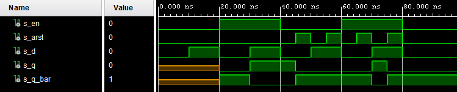
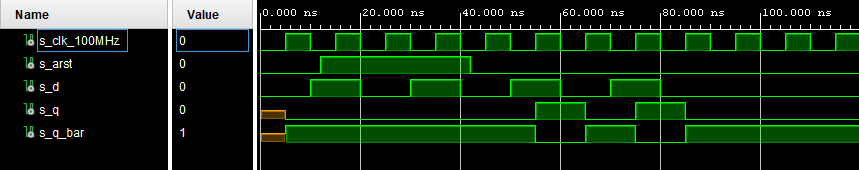
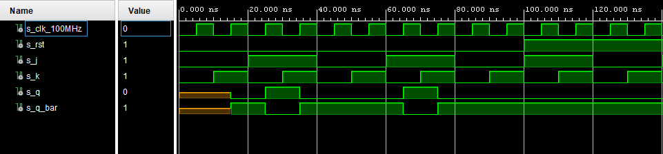
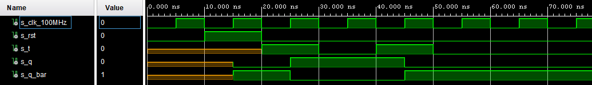

## Lab 7
# Task 1


| **D** | **Qn** | **Q(n+1)** | **Comments** |     
   | :-: | :-: | :-: | :-- |
   | 0 | 0 | 0 | No change | 
   | 0 | 1 | 0 | Reset |
   | 1 | 1 | 1 | No change | 
   | 1 | 0 | 1 | Set | 
- D q(n+1) = d 

   | **J** | **K** | **Qn** | **Q(n+1)** | **Comments** |
   | :-: | :-: | :-: | :-: | :-- |
   | 0 | 0 | 0 | 0 | No change |
   | 0 | 0 | 1 | 1 | No change |
   | 0 | 1 | 0 | 0 | Reset | 
   | 0 | 1 | 1 | 0 | Reset |
   | 1 | 0 | 0 | 1 | Set | 
   | 1 | 0 | 1 | 1 | Set |
   | 1 | 1 | 0 | 1 | Toggle |
   | 1 | 1 | 1 | 0 | Toggle |
- JK q(n+1) = j * /qn + /k * qn

   | **T** | **Qn** | **Q(n+1)** | **Comments** |
   | :-: | :-: | :-: | :-- |
   | 0 | 0 | 0 | No change | 
   | 0 | 1 | 1 | No change | 
   | 1 | 0 | 1 | Toggle | 
   | 1 | 1 | 0 | Toggle | 
- T q(n+1) = t * /qn + /t * qn
 
# Task 2
- VHDL code listing of the process p_d_latch
```vhdl
     p_d_latch : process (d, arst, en)
   begin
     if   (arst = '1') then
            q     <= '0';
            q_bar <= '1';
     elsif (en = '1')  then
            q     <= d;
            q_bar <= not d;
       
     end if;
   end process p_d_latch;  
```
- Listing of VHDL reset and stimulus processes from the testbench tb_d_latch.vhd
```vhdl
--------------------------------------------------------------------
-- Reset generation process
--------------------------------------------------------------------
    p_reset_gen :   process
    begin
        s_arst <=  '0';
         wait for 45 ns;
        s_arst <=  '1';
         wait for 10 ns;
        s_arst <=  '0';
         wait for 10 ns;
        s_arst <=  '1';
         wait for 10 ns;
        s_arst <=  '0';
         wait for 10 ns;
        s_arst <=  '1';   
         wait;
    end process p_reset_gen;
    
--------------------------------------------------------------------
-- Data generation process
--------------------------------------------------------------------
    p_stimulus : process
    begin
       report "Stimulus process started" severity note;
        s_en    <= '0';
        s_d     <= '0';
       wait for 10 ns;
        s_en    <= '0';
        s_d     <= '1';
       wait for 10 ns;
        s_en    <= '1';
        s_d     <= '0';
       wait for 10 ns;
        s_en    <= '1';
        s_d     <= '1';
        
       assert(s_q =  '1' and s_q_bar = '0')
       report "First assert s_q = 1, s_q_bar = 0" severity error;
        
       wait for 10 ns;
        s_en    <= '0';
        s_d     <= '0';
       wait for 10 ns;
        s_en    <= '0';
        s_d     <= '1';
       wait for 10 ns;
        s_en    <= '1';
        s_d     <= '0';
        
       assert(s_q =  '1' and s_q_bar = '0')
       report "Second assert s_q = 1, s_q_bar = 0" severity error;
        
       wait for 10 ns;
        s_en    <= '1';
        s_d     <= '1';
       wait for 10 ns;
        
        s_en    <= '0';
        s_d     <= '0';
        
       report "Stimulus process finished" severity note;
       wait;
    end process p_stimulus;

```
- Screenshot with simulated time waveforms



# Task 3
## d_ff_arst
- VHDL code listing of the process
```vhdl
 p_d_ff_arst : process (clk, arst)
      begin
        if (arst = '1') then
             q     <= '0';
             q_bar <= '1';
    
        elsif rising_edge(clk) then
              q     <= d;
              q_bar <= not d;
        
        end if;
  
      end process p_d_ff_arst;
```
- Listing of VHDL reset and stimulus processes
```vhdl
 --------------------------------------------------------------------
    -- Reset generation process
    --------------------------------------------------------------------
    p_reset_gen :   process
    begin
        s_arst <=  '0';
        wait for 12 ns;
        s_arst <=  '1';
        wait for 30 ns;                    
        s_arst <=  '0';
        
        wait;
    end process p_reset_gen;
    
    --------------------------------------------------------------------
    -- Data generation process
    --------------------------------------------------------------------
    p_stimulus : process
    begin
         report "Stimulus process started" severity note;
        s_d     <= '0';
         wait for 10 ns;
        s_d     <= '1';
         wait for 10 ns;
        s_d     <= '0';
         wait for 10 ns;
        s_d     <= '1';
        
         assert(s_q =  '1' and s_q_bar = '0') --1
         report "First assert " severity error;
        
         wait for 10 ns;
        s_d     <= '0';
         wait for 10 ns;
        s_d     <= '1';
         wait for 10 ns;
        s_d     <= '0';
        
         assert(s_q =  '0' and s_q_bar = '1') --2
         report "Second assert " severity error;
        
         wait for 10 ns;
        s_d     <= '1';
         wait for 10 ns;
        s_d     <= '0';

        report "Stimulus process finished" severity note;
        wait;
    end process p_stimulus;

```
- Screenshot with simulated time waveforms



## d_ff_rst
- VHDL code listing of the process
```vhdl
 p_d_ff_rst : process (clk)
    begin
        if rising_edge(clk) then
            if (rst = '1') then
                q     <= '0';
                q_bar <= '1';
            else
                q     <= d;
                q_bar <= not d;
            end if;
        end if;
    end process p_d_ff_rst;

```
- Listing of VHDL reset and stimulus processes
```vhdl
```
- Screenshot with simulated time waveforms

## jk_ff_rst
- VHDL code listing of the process
```vhdl
p_jk_ff_rst : process (clk)
      begin        
        if rising_edge(clk) then
           if (rst = '1') then
              s_q <= '0';
           else
              if (j= '0' and k = '0')    then
                   s_q <= s_q;
              elsif (j= '0' and k = '1') then
                   s_q <= '0';
              elsif (j= '1' and k = '0') then
                   s_q <= '1';
              elsif (j= '1' and k = '1') then
                   s_q <= not s_q; 
              end if;
           end if;   
      
        end if;
    
      end process p_jk_ff_rst;

      q     <= s_q;
      q_bar <= not s_q;

```
- Listing of VHDL reset and stimulus processes
```vhdl
--------------------------------------------------------------------
    -- Reset generation process
    --------------------------------------------------------------------
    p_reset_gen :   process
    begin
        s_rst <=  '0';
        wait for 100 ns;        
        s_rst <=  '1';
        wait for 80 ns;        
        s_rst <=  '0';
        
        wait;
    end process p_reset_gen;

    --------------------------------------------------------------------
    -- Data generation process
    --------------------------------------------------------------------
    p_stimulus : process
    begin
         report "Stimulus process started" severity note;
         
         s_j <=  '0';
         s_k <=  '0';
          wait for 10ns;
          assert (s_q = '1' and s_q_bar = '0') --1
          report "First assert" severity note;
          
        s_j <=  '0';
        s_k <=  '1';
         wait for 10ns;
         assert (s_q = '0' and s_q_bar = '1') --2
         report "Second assert" severity note; 
        
        s_j <=  '1';
        s_k <=  '0'; 
         wait for 10ns;
         assert (s_q = '1' and s_q_bar = '0') --3
         report "Third assert" severity note;
         
        s_j <=  '1';
        s_k <=  '1';
         wait for 10ns;
         assert (s_q = '1' and s_q_bar = '0') --4
         report "Fourth assert" severity note;
         
        
        
    end process p_stimulus;
```
- Screenshot with simulated time waveforms



## t_ff_rst
- VHDL code listing of the process
```vhdl
 p_t_ff_rst : process (clk)
    begin
        if rising_edge(clk) then
            if (rst = '1') then
                s_q     <= '0';
                s_q_bar <= '1';
            elsif (t = '1') then
                s_q     <= not s_q;
                s_q_bar <= s_q;
            end if;
        end if;
    end process p_t_ff_rst;
    
    q       <= s_q;
    q_bar   <= s_q_bar;

```
- Listing of VHDL reset and stimulus processes
```vhdl
```
- Screenshot with simulated time waveforms



# Task 4


